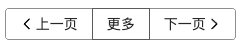

## `Button`组件细节

1. 组件接收数据的合法性，可通过`validator`方法检测，如果非法返回`false`，合法返回`true`。

```js
new Vue({
  props: {
    iconPosition: {
      type: String,
      default: "left",
      validator(value) {
        return value === "left" || value === "right";
      },
    },
  },
});
```

2. 动态绑定`class`

当`{'icon-right': true}`页面中会显示`icon-right`这个`class`

```js
:class="{[`icon-${iconPosition}`]: true}"
```

3. `button-group`样式



- 使用负 margin 可以解决边框重合问题
- `hover`时边框高亮，用`posiiton: relative; z-index: 1;`可以解决

```css
.g-button :not(:first-child) {
  margin-left: -1px;
}
.g-button:hover {
  position: relative;
  z-index: 1;
}
```

## 单元测试

概念：

- `BDD`：行为驱动开发，`Behavior-driven development`
- `TDD`：测试驱动开发，`Test-driven development`
- `Assert`：断言

行为驱动开发是用来模拟用户行为，用自然语言描述需求；测试驱动开发是完成产品需求；断言是我主观臆断认为是对的，如果断言正确，啥事也不会发生，否则会报错。

这里使用的单元测试工具是`chai`

### 模拟点击

使用`spies`可以在单元测试中模拟点击事件

```js
import chai from "chai";
import spies from "chai-spies";

chai.use(spies);
const expect = chai.expect;

const Constructor = Vue.extend(Button);
const vm = new Constructor({
  propsData: {
    icon: "settings",
  },
});
vm.$mount();

let spy = chai.spy(function() {}); // 生成一个点击函数
vm.$on("click", spy); // 绑定事件

let button = vm.$el;
button.click();
expect(spy).to.have.been.called(); // 模拟点击事件
vm.$el.remove();
vm.$destroy();
```

每个单元测试的`case`，在使用完后都要主动销毁

```js
vm.$el.remove(); // 元素销毁
vm.$destroy(); // 实例销毁
```
